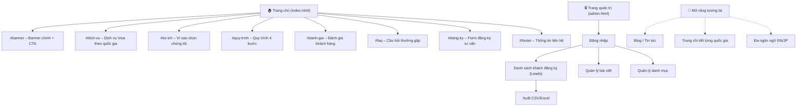
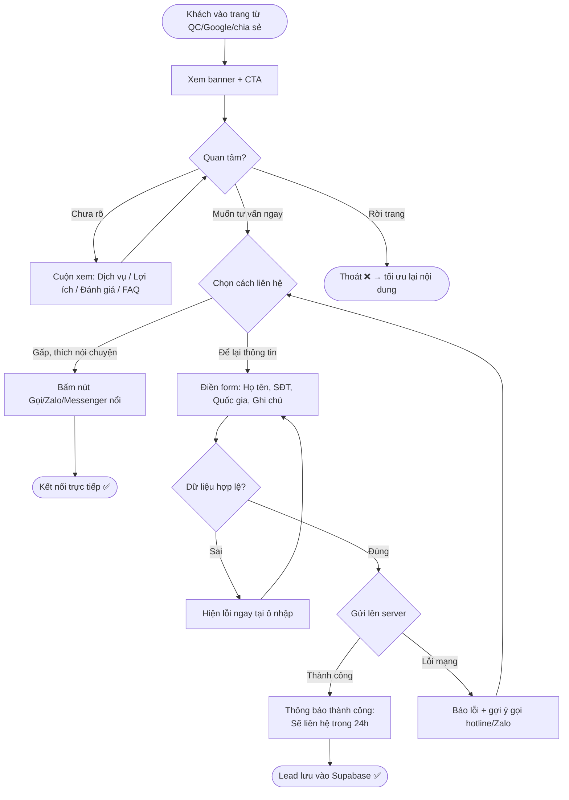
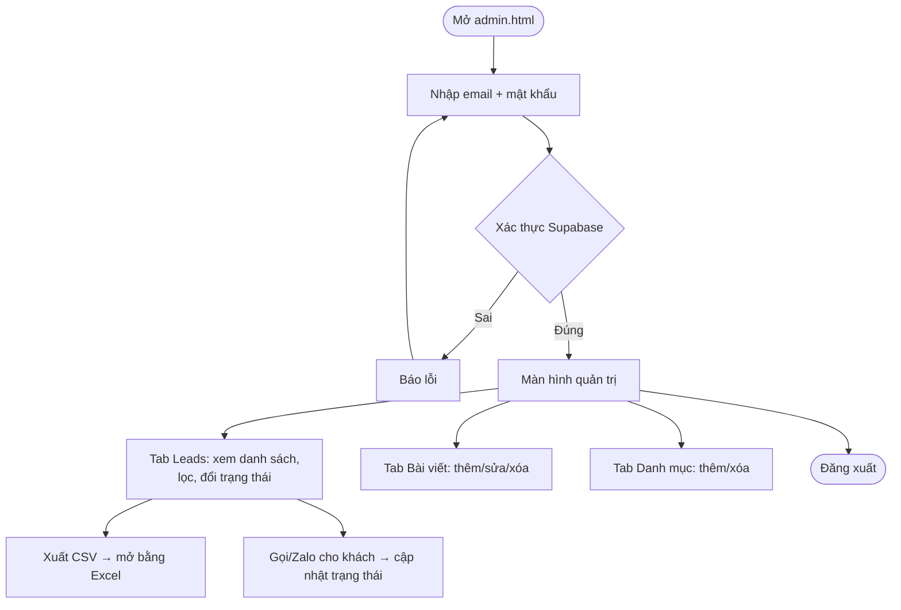
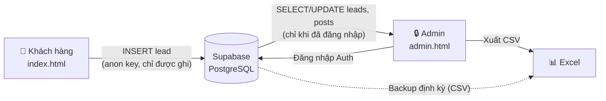

# 02. Sitemap & User Flow

## 1. Sitemap (Cấu trúc website)

Giai đoạn 1 là landing page 1 trang (one-page); các mục điều hướng cuộn tới section tương ứng. Trang admin tách riêng, không hiển thị công khai.

## 2. User Flow – Khách hàng (luồng chính: đăng ký tư vấn)

## 3. User Flow – Admin

## 4. Luồng dữ liệu (Data Flow)

**Giải thích cho người không code:** Supabase là dịch vụ "cơ sở dữ liệu trên mây" miễn phí. Form trên web chỉ có quyền GHI THÊM dữ liệu (không đọc được), nên người ngoài không thể xem danh sách khách. Chỉ admin đăng nhập mới xem/sửa được — cơ chế này gọi là RLS (Row Level Security – bảo mật theo dòng dữ liệu).

---

## ⚠️ Rà soát

| # | Vấn đề | Loại | Impact | Đề xuất |
|---|---|---|---|---|
| 1 | One-page → khó SEO cho từng quốc gia riêng | Risk | Trung bình | Phase mở rộng: tách trang chi tiết `/visa-nhat-ban`... khi cần SEO |
| 2 | Khách bấm nút Zalo trên PC (không cài app) | Edge case | Thấp | Link `zalo.me` tự mở bản web — đã đúng hướng |
| 3 | Flow chưa có bước đo lường (analytics) | Gap | Trung bình | Gắn Google Analytics / Meta Pixel trước khi chạy quảng cáo |
