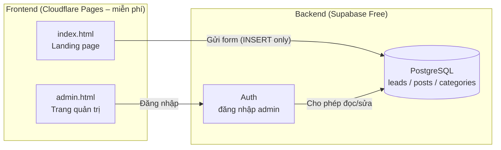

# 06. So sánh & Đề xuất Công nghệ

Tiêu chí đánh giá (theo yêu cầu): dễ học, dễ bảo trì, nhiều tài liệu, miễn phí, cộng đồng lớn — cho người KHÔNG biết lập trình.

## 1. So sánh 4 phương án

| Tiêu chí | ① HTML/CSS/JS thuần + Supabase | ② Next.js + Supabase | ③ WordPress | ④ Wix/Webflow (kéo thả) |
|---|---|---|---|---|
| Độ khó với người không code | ⭐ Dễ nhất (mở file là hiểu, sửa text trực tiếp) | ⭐⭐⭐ Khó (cần Node.js, React, terminal) | ⭐⭐ Trung bình (giao diện admin dễ, nhưng cài đặt/plugin/bảo trì phức tạp) | ⭐ Dễ (kéo thả) |
| Chi phí khởi đầu | **0đ** (Cloudflare Pages + Supabase Free) | 0đ (Vercel Free) | ~50–100k/tháng hosting + nguy cơ phí plugin | 0đ bản basic, nhưng bản bỏ quảng cáo + domain riêng ~300–500k/tháng |
| Tốc độ tải trang | ⭐⭐⭐ Rất nhanh (tĩnh, nhẹ) | ⭐⭐⭐ Nhanh | ⭐ Chậm nếu nhiều plugin | ⭐⭐ Trung bình |
| Form + lưu lead | Supabase (miễn phí, bảo mật RLS) | Supabase | Plugin Contact Form 7 + database | Có sẵn |
| Quản lý bài viết | Admin tự code (đơn giản) | Cần code thêm | ⭐⭐⭐ Mạnh nhất (là CMS chuyên nghiệp) | Có sẵn |
| Khả năng Claude hỗ trợ sửa sau này | ⭐⭐⭐ Tốt nhất — gửi file HTML cho Claude sửa trực tiếp | ⭐⭐ Được nhưng phức tạp | ⭐ Khó (giao diện admin, không phải file) | ⭐ Rất khó (nền tảng đóng) |
| Bị khóa vào nền tảng (vendor lock-in) | Không | Không | Ít | ⭐ Cao — không xuất code được |
| Rủi ro bảo trì | Rất thấp | Cập nhật dependency | Cập nhật plugin liên tục, dễ bị hack nếu bỏ bê | Phụ thuộc nhà cung cấp |

## 2. Đề xuất: Phương án ① — HTML/CSS/JS thuần + Supabase

**Lý do chọn (cho trường hợp cụ thể của bạn):**

1. Bạn không code, nhưng CÓ Claude — file HTML thuần là định dạng Claude sửa được chính xác nhất. Muốn đổi nội dung, thêm quốc gia, đổi màu... chỉ cần yêu cầu Claude sửa file rồi kéo lên hosting lại.
2. Chi phí 0đ thật sự: Cloudflare Pages miễn phí không giới hạn băng thông; Supabase Free đủ cho <500 lead/tháng.
3. Nhanh nhất cho quảng cáo: trang tĩnh tải <1s → điểm chất lượng quảng cáo Google/Facebook cao hơn → giá click rẻ hơn.
4. Không có gì để hỏng: không plugin, không phiên bản, không database phải vá lỗi.

**Khi nào nên chuyển phương án khác:**

| Tình huống | Chuyển sang |
|---|---|
| Viết blog SEO nhiều (>2 bài/tuần), cần soạn thảo trực quan | ③ WordPress |
| Có developer riêng, cần nhiều tính năng động | ② Next.js |
| Cần làm site trong 1 ngày, chấp nhận trả phí tháng | ④ Wix/Webflow |

## 3. Kiến trúc được chọn

**Giải thích thuật ngữ:**

| Thuật ngữ | Nghĩa |
|---|---|
| Static site (trang tĩnh) | Website chỉ gồm file HTML/CSS/JS, không cần server xử lý → nhanh, rẻ, an toàn |
| Supabase | Dịch vụ backend miễn phí: database PostgreSQL + đăng nhập + API tự động |
| RLS (Row Level Security) | Luật bảo mật ở tầng database: form public chỉ được GHI, chỉ admin đăng nhập mới ĐỌC |
| Anon key | Chìa khóa công khai đặt trong web — an toàn vì RLS giới hạn quyền của nó |
| CDN | Mạng máy chủ toàn cầu giúp trang tải nhanh ở mọi nơi (Cloudflare có sẵn) |

## 4. Giới hạn gói miễn phí cần biết

| Dịch vụ | Giới hạn Free | Đủ dùng khi nào |
|---|---|---|
| Cloudflare Pages | 500 lần deploy/tháng, băng thông không giới hạn | Gần như luôn đủ |
| Supabase Free | 500MB database, 50.000 người dùng auth, tạm dừng nếu 7 ngày không hoạt động | Đủ cho hàng nghìn lead; nhớ vào dashboard hàng tuần |
| Google Fonts | Miễn phí không giới hạn | Luôn đủ |

---

## ⚠️ Rà soát

| # | Vấn đề | Loại | Impact | Đề xuất |
|---|---|---|---|---|
| 1 | Supabase Free tự tạm dừng sau 7 ngày không hoạt động → form bị lỗi âm thầm | Risk | Cao | Vào dashboard hàng tuần; hoặc lên lịch nhắc; nâng Pro ($25/tháng) khi có doanh thu ổn định |
| 2 | Anon key nằm trong file HTML ai cũng xem được | Risk | Thấp | Đây là thiết kế chuẩn của Supabase — an toàn NẾU cấu hình RLS đúng theo script SQL kèm theo (đã viết sẵn) |
| 3 | Quản lý bài viết bằng admin tự code sẽ đơn giản hơn WordPress | Gap | Thấp | Chấp nhận giai đoạn đầu; nhu cầu blog tăng thì tách blog sang WordPress subdomain sau |
