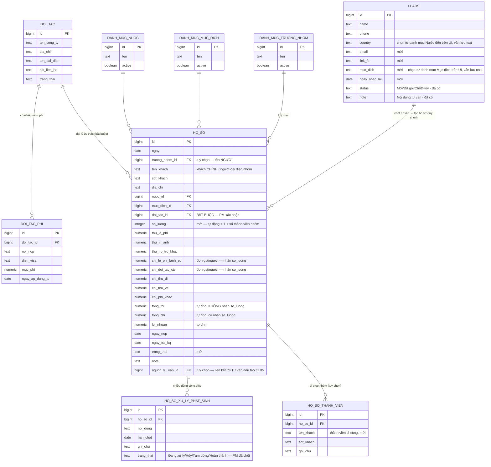

# Phase 2 — Thiết kế CSDL (ERD) & mô tả màn hình

> Figma MCP trong phiên này **chưa được authorize** (cần kết nối qua Figma connector settings) nên không dựng được mockup trực tiếp trong Figma. Theo đúng quy tắc dự án (mục 7 — Diagram), cung cấp trước bằng Mermaid + mô tả để dựng lại trong FigJam sau khi kết nối.

## 1. Sơ đồ quan hệ dữ liệu (ERD)

**Ghi chú:**
- `LEADS` là bảng `leads` đã có sẵn từ Phase 1 (form đăng ký trên landing page), chỉ mở rộng thêm cột — không tạo bảng "tư vấn" riêng, tránh trùng dữ liệu 2 nơi cho cùng 1 khách khi họ vừa gửi form web vừa được tư vấn viên nhập tay. `ngay_nhac_lai` CHỈ nằm ở `LEADS`, không có ở `HO_SO` (PM xác nhận). `country`/`muc_dich` hiển thị dạng dropdown chọn từ danh mục trên UI (PM xác nhận, đổi từ chữ tự do ban đầu) nhưng vẫn lưu kiểu text ở CSDL, không NOT NULL — để không phá insert từ form công khai trên landing page.
- `DOI_TAC` = tên bảng kỹ thuật, tên hiển thị trên giao diện là **"Đại lý ủy thác"** (PM xác nhận đổi tên) — mỗi hồ sơ giờ BẮT BUỘC phải chọn 1 đại lý, không còn tuỳ chọn để trống cho khách lẻ.
- `HO_SO_XU_LY_PHAT_SINH` là bảng mới theo yêu cầu bổ sung của PM: mỗi hồ sơ có thể có nhiều dòng công việc phát sinh cần theo dõi hạn chốt. Trạng thái có 4 giá trị PM tự chốt: Đang xử lý/Hủy/Tạm dừng/Hoàn thành — "quá hạn" trên Dashboard chỉ tính khi đang ở "Đang xử lý".
- `nguon_tu_van_id` trên `HO_SO`: cột đề xuất thêm (cần PM xác nhận) để biết 1 hồ sơ được tạo ra từ dòng Tư vấn nào — phục vụ tính năng "chốt Tư vấn → tạo Hồ sơ" mô tả ở mục 2 bên dưới.
- `HO_SO_THANH_VIEN` là bảng mới theo yêu cầu bổ sung của PM: 1 hồ sơ có thể đi theo nhóm nhiều khách hàng. `ten_khach`/`sdt_khach` trên `HO_SO` là khách CHÍNH, bảng này lưu các thành viên ĐI CÙNG (không tính khách chính). `so_luong` trên `HO_SO` tự động = 1 + số dòng ở bảng này (cập nhật bằng trigger, không nhập tay) — dùng để nhân "Chi — Phí lãnh sự" và "Chi — Đại lý/CTV" khi tính Tổng chi. **Lưu ý rủi ro:** phần Thu (Lệ phí, In ảnh, Hỗ trợ khác) KHÔNG tự nhân theo `so_luong` — nếu hồ sơ nhóm 2-3 người mà Thu không tăng trong khi Chi tăng gấp đôi/ba, lợi nhuận mỗi hồ sơ nhóm sẽ giảm mạnh so với hồ sơ 1 người. Cần PM xác nhận đây có đúng ý muốn không trước khi code (xem rà soát ở `Phase2_Dac_ta.xlsx` sheet 6).

## 2. Mô tả màn hình (để dựng wireframe trong FigJam)

### Dashboard
- Hàng trên: 4 thẻ số liệu (stat cards, theo mẫu `.stat-row` đã có trong `admin.html`) — Doanh thu tháng này, Lợi nhuận tháng này, Hồ sơ đang xử lý, Số khách tư vấn cần nhắc lại trong 7 ngày.
- Giữa: 2 biểu đồ cột/đường cạnh nhau — "Doanh thu & Lợi nhuận theo tháng" (line/bar kết hợp), "Số lượng hồ sơ theo tháng" (bar).
- Dưới: bảng "Xử lý phát sinh cần chú ý" (tên khách, nội dung, hạn chốt, dòng nào Hạn chốt = hôm nay hoặc đã quá hạn thì tô đỏ) + bảng nhỏ "Khách tư vấn cần nhắc lại" (tên, SĐT, ngày hẹn) — KHÔNG còn mục "Top đối tác" (PM xác nhận bỏ).

### Quản lý hồ sơ
- Bộ lọc trên: theo Trạng thái, Nước đến, Đại lý ủy thác, khoảng ngày nộp.
- Bảng danh sách theo mẫu `.tbl-wrap`/`table` có sẵn — cột: Ngày, Tên khách, Nước đến, Mục đích, Đại lý ủy thác, Trạng thái (pill màu như mẫu `.pill`), Lợi nhuận, Ngày trả KQ.
- Modal thêm/sửa (theo mẫu `.overlay`/`.modal` có sẵn): chia 2 cột — cột trái "Thông tin khách" (Ngày, Trưởng nhóm, Tên/SĐT/Địa chỉ khách CHÍNH, Nước đến, Mục đích, Đại lý ủy thác — bắt buộc chọn, **Số lượng hiển thị readonly** = 1 + số thành viên nhóm), cột phải "Thu chi & tiến độ" (các ô Thu/Chi — 2 ô "Phí lãnh sự"/"Đại lý-CTV" ghi rõ nhãn "(đơn giá/người)", Tổng thu/Tổng chi/Lợi nhuận hiển thị readonly tự tính, Ngày nộp/Trả KQ, Trạng thái, Note).
- Bên dưới modal: bảng con "Thành viên nhóm" — thêm/sửa/xoá từng dòng (Tên, SĐT, Ghi chú) cho các khách đi cùng khách chính; mỗi lần thêm/xoá 1 dòng, ô "Số lượng" và Tổng chi/Lợi nhuận tự cập nhật lại ngay (không cần lưu form chính).
- Bên dưới nữa: bảng con "Xử lý phát sinh" — thêm/sửa/xoá từng dòng (Nội dung, Hạn chốt, Ghi chú, Trạng thái: Đang xử lý/Hủy/Tạm dừng/Hoàn thành), không cần lưu form chính để thêm dòng mới.

### Tư vấn
- Bảng danh sách (dùng lại toàn bộ style bảng của Hồ sơ) — cột: Ngày, Tên, SĐT, Nước đến (dropdown), Mục đích (dropdown), Trạng thái (pill), Ngày nhắc lại.
- Modal thêm/sửa: Tên, SĐT, Email, Link Facebook, Nước đến (chọn danh mục, bắt buộc), Mục đích (chọn danh mục, bắt buộc), Nội dung tư vấn, Trạng thái tư vấn, Ngày nhắc lại.
- **Luồng "Chốt tư vấn → tạo Hồ sơ"** (PM yêu cầu bổ sung): khi bấm Lưu với Trạng thái tư vấn = "Chốt" (PM xác nhận: hiện popup MỖI LẦN lưu 1 dòng đang ở Chốt, kể cả dòng đã Chốt từ trước — không chỉ lần đầu chuyển trạng thái), hiện popup:
  > "Hồ sơ này đã chốt, Chị Hiền muốn thêm thông tin này vào hồ sơ xử lý không?"
  - **Đồng ý** → lưu dòng Tư vấn, rồi điều hướng sang tab Hồ sơ, mở form tạo mới đã PRE-FILL: Tên khách, SĐT, Nước đến, Mục đích, Note (= Nội dung tư vấn), và ghi `nguon_tu_van_id`. Đại lý ủy thác KHÔNG pre-fill được (Tư vấn không thu thập) — nhân viên tự chọn trước khi lưu vì đây là field bắt buộc ở Hồ sơ.
  - **Không cần** → chỉ lưu dòng Tư vấn, ở lại màn Tư vấn.

### Đại lý ủy thác (Master — trước đây gọi là "Đối tác")
- Bảng danh sách đại lý (Tên công ty, Người đại diện, SĐT, Trạng thái hợp tác).
- Bấm vào 1 đại lý → mở trang chi tiết có bảng phí con bên dưới (Nơi nộp × Diện visa × Mức phí × Ngày áp dụng từ) — cho thêm dòng phí mới khi đại lý đổi giá, các dòng cũ vẫn giữ để tính đúng lợi nhuận hồ sơ cũ.

### Cài đặt chung
- 3 tab nhỏ hoặc 3 khối trong 1 trang: Nước đến / Mục đích / Trưởng nhóm — mỗi khối là danh sách dạng thẻ có thể Thêm/Sửa/Ẩn (active = false thay vì xoá hẳn, để không vỡ dữ liệu Hồ sơ cũ đang tham chiếu).
