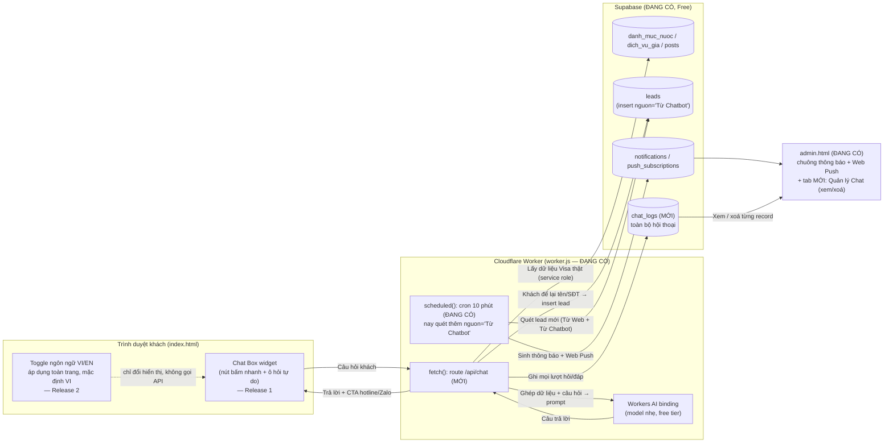

# Báo cáo Phân tích Khả thi — Chat Box hỗ trợ Visa (Trang Home, Top Visa)

| Mục | Nội dung |
|---|---|
| Dự án | Vs-Landing-Page — bổ sung Chat Box trang Home |
| Công ty | Top Visa (Đà Nẵng) |
| Người phân tích | Claude (Cowork) |
| Ngày | 2026-08-28 |
| Phiên bản | 1.3 |
| Nguồn tham chiếu | `08_Chatbox/yeu_cau.md` + khảo sát trực tiếp source code thực tế (`02_Source`, `05_Database`, `worker.js`, `CLAUDE.md`, `01_Docs`) + toàn bộ câu trả lời PM trong sheet `Can_xac_nhan` |

## 変更履歴 (Lịch sử thay đổi)

| Ver | Ngày | Người sửa | Nội dung |
|---|---|---|---|
| 1.0 | 2026-08-28 | Claude | Tạo mới — phân tích khả thi theo yêu cầu trong `yeu_cau.md` |
| 1.1 | 2026-08-28 | Claude | Cập nhật theo câu trả lời PM (traffic, ngân sách, tự động hoá, tiếng Anh) — **chốt phương án cuối**, gộp lộ trình 2 giai đoạn thành 1 giải pháp thống nhất (xem mục 4-5) |
| 1.2 | 2026-08-28 | Claude | Cập nhật theo 2 câu trả lời bổ sung: (1) cần màn hình admin xem/xoá từng chat của khách → bảng `chat_logs` chuyển từ "tuỳ chọn" thành **bắt buộc**; (2) toggle ngôn ngữ Việt/Anh áp dụng **toàn site** (không chỉ Chat Box), mặc định tiếng Việt → **tăng quy mô/thời gian dự án**, xem mục 1-5. Đồng thời tạo tài liệu đặc tả triển khai riêng cho Claude Code (`Dac_ta_Trien_khai_Chatbox.md`) |
| 1.3 | 2026-08-28 | Claude | Cập nhật theo 3 câu trả lời cuối: (1) nội dung động (bài viết/giá/thông tin quốc gia) **cũng cần dịch tiếng Anh**, admin nhập song ngữ trực tiếp → mở rộng thêm scope Release 2; (2) đề xuất hướng xử lý FAQ/JSON-LD cho SEO (xem mục 6); (3) PM xác nhận **tách 2 đợt release**: Release 1 = Chat Box tiếng Việt + AI (triển khai ngay), Release 2 = chuyển ngữ toàn site (làm sau) — cập nhật roadmap mục 5 theo đúng 2 đợt này |

---

## Tóm tắt nhanh

Hệ thống hiện tại là **static site (HTML/CSS/JS thuần, không framework)** chạy trên **Cloudflare Pages/Workers**, dữ liệu ở **Supabase Free** (Postgres + RLS), không có backend server truyền thống — chỉ có **1 Cloudflare Worker** (`worker.js`) hiện đang phục vụ file tĩnh và chạy 1 cron job thông báo mỗi 10 phút. Đây là kiến trúc rất thuận lợi để thêm Chat Box chi phí thấp: có thể tận dụng lại đúng Worker đang có (không cần thêm hạ tầng mới) và Supabase đã có sẵn dữ liệu Visa theo quốc gia (phí, thời gian xét duyệt, checklist hồ sơ) để làm "kiến thức nền" cho chatbot.

**PM đã xác nhận (xem mục 6):** traffic hiện ~50–100 lượt/ngày (site mới), ngân sách **chỉ chấp nhận Free** (không trả thêm), chatbot cần **trả lời tự động** (không bắt buộc chuyển tiếp nhân viên thật), thông tin khách để lại cần **hiện ra ở trang admin** như lead thường, Cloudflare Workers đang ở **gói Free**, cần hỗ trợ thêm **tiếng Anh** ngay từ đầu — và bổ sung: (1) admin cần **xem được nội dung chat của từng khách + xoá được từng đoạn chat**, (2) ngôn ngữ Việt/Anh áp dụng cho **toàn bộ landing page** (không chỉ Chat Box), mặc định tiếng Việt, có nút chọn chuyển hẳn sang tiếng Anh.

**Phương án chốt (chi tiết ở mục 4-5):** với traffic thấp và ngân sách 0đ bắt buộc, **khuyến nghị xây dựng 1 giải pháp hợp nhất về kỹ thuật**: nút bấm nhanh (0đ, tức thời, song ngữ Việt/Anh) cho các câu hỏi phổ biến nhất + ô chat tự do dùng **Cloudflare Workers AI** (free tier 10.000 neuron/ngày, thừa sức đáp ứng quy mô hiện tại) cho câu hỏi ngoài kịch bản, luôn "ground" bằng dữ liệu Visa thật trong Supabase. Khi khách để lại tên/SĐT trong chat, hệ thống ghi thẳng vào bảng `leads` có sẵn (gắn nguồn `Từ Chatbot`) để hiện ra ở trang admin đúng như lead từ form, **đồng thời** lưu toàn bộ hội thoại vào bảng mới `chat_logs` để admin xem lại/xoá theo yêu cầu.

**Bản 1.3 — PM xác nhận tách 2 đợt release (xem mục 1.7):** **Release 1** giao toàn bộ Chat Box (nút bấm nhanh + AI + lưu lead + `chat_logs` + tab admin "Quản lý Chat") — AI vẫn trả lời được cả tiếng Việt và tiếng Anh ngay từ Release 1. **Release 2** (làm sau) mới xử lý **chuyển ngữ toàn site**: toggle Việt/Anh cho nội dung tĩnh của `index.html` **và** bổ sung cột song ngữ cho nội dung động do admin tự nhập (bài viết, giá, thông tin quốc gia — điểm mới xác nhận ở bản 1.3). Chi phí vận hành vẫn dự kiến **0đ** ở cả 2 đợt (không thêm dịch vụ trả phí nào), chỉ khác nhau về **thời điểm bàn giao** và **công sức triển khai**.

---

## 0. Hiện trạng hệ thống thực tế (kết quả khảo sát source code)

> Theo đúng yêu cầu "dựa trên source code thực tế, không chỉ nhận định lý thuyết" — bảng dưới đây liệt kê những gì đã xác minh trực tiếp trong repo, không suy đoán.

| Thành phần | Hiện trạng thực tế đã xác minh |
|---|---|
| Frontend | `02_Source/index.html` (74KB) + `admin.html` (207KB) — HTML/CSS/JS thuần trong 1 file, KHÔNG dùng React/Vue/framework nào, KHÔNG có bước build (không webpack/vite). Gọi Supabase bằng `fetch()` REST thô, không dùng thư viện `supabase-js`. |
| Hosting | Cloudflare Pages/Workers (`wrangler.toml`): assets = thư mục `02_Source`, có 1 cron trigger `*/10 * * * *`. Deploy qua `wrangler deploy`. |
| Backend logic | Đúng **1 file** `worker.js` (233 dòng). Hàm `fetch()` hiện tại **chỉ** trả file tĩnh (`return env.ASSETS.fetch(request)`) — chưa có route API nào xử lý logic động. Hàm `scheduled()` chạy cron quét `ho_so`/`leads` sinh thông báo + Web Push. |
| Database | Supabase Postgres Free, đã qua **10 phase migration** (`05_Database/01_...` → `10_...`), RLS (Row Level Security) bật cho toàn bộ bảng. |
| Dữ liệu Visa có sẵn (quan trọng cho chatbot) | Bảng `danh_muc_nuoc` có sẵn cột `le_phi` (lệ phí), `thoi_gian_xet_duyet`, `checklist` (giấy tờ cần chuẩn bị), `ghi_chu` theo từng quốc gia — **nhưng hiện chỉ role `authenticated` (admin) đọc được**, chưa mở cho public. Bảng `dich_vu_gia` (giá dịch vụ 7 quốc gia + "Khác") đã mở cho `anon` đọc — đang hiển thị công khai trên landing page. Bảng `posts` (bài viết/kinh nghiệm) cũng đã mở đọc công khai. |
| FAQ hiện có | `index.html` đã có sẵn **FAQ tĩnh (accordion), 6-8 câu**, đồng thời là dữ liệu cho `<script type="application/ld+json">` chuẩn `FAQPage` phục vụ SEO (rich snippet Google). Comment trong code ghi rõ: "Nội dung FAQ PHẢI khớp đúng với phần hiển thị" — nghĩa là **không được để chatbot trả lời sai lệch/mâu thuẫn với FAQ tĩnh này**. |
| Nút liên hệ nổi | Đã có sẵn cụm nút `position:fixed` góc dưới phải (Zalo `.float-zalo`) và góc dưới trái (`.scroll-top-btn`) — Chat Box mới phải tính toán vị trí để **không đè lên** các nút này, đặc biệt trên mobile (persona chính 70%+ dùng mobile). |
| Bảo mật khoá bí mật | `SUPABASE_ANON_KEY` được phép lộ trong `index.html` (thiết kế chuẩn, an toàn nhờ RLS). Ngược lại `SUPABASE_SERVICE_ROLE_KEY` **tuyệt đối không** được đặt trong file — chỉ đặt qua Cloudflare Dashboard (biến "Encrypt"). Đây là nguyên tắc bắt buộc áp dụng tương tự cho bất kỳ khoá AI API nào sẽ thêm. |
| Quy mô vận hành | Dự án đang chạy thật (không phải demo) — có lịch sử commit xử lý sự cố thật (thông báo lỗi, backup tool lỗi...), vận hành bởi 1 PM không code, toàn bộ code do Claude Code viết/sửa theo yêu cầu từng phiên. |

---

## 1. Đánh giá quy mô và độ phức tạp dự án

### 1.1 Quy mô dự án

| Tiêu chí | Đánh giá |
|---|---|
| Quy mô tổng thể | **Trung bình** (tăng từ "Nhỏ-Trung bình" ở bản 1.1) — do bổ sung màn hình quản lý chat trong admin + chuyển ngữ toàn site. **Bản 1.3: PM xác nhận tách 2 đợt release riêng biệt (xem 1.7)** nên khối lượng việc mỗi đợt release thực tế nhỏ hơn, không phải làm 1 lần toàn bộ |
| Số màn hình/thành phần mới | 2 (widget Chat Box nổi trên `index.html`; tab/màn hình "Quản lý Chat" mới trong `admin.html`) + cơ chế toggle ngôn ngữ áp dụng xuyên suốt `index.html` (Release 2) |
| Số bảng DB mới | 1 — **`chat_logs` nay bắt buộc** (PM xác nhận cần xem + xoá từng đoạn chat trong admin, không còn là tuỳ chọn) |
| Số cột DB mới (bản 1.3, Release 2) | 7 cột song ngữ bổ sung vào bảng đã có: `posts.title_en`, `posts.content_en`, `dich_vu_gia.quoc_gia_en`, `danh_muc_nuoc.ten_en`, `danh_muc_nuoc.thoi_gian_xet_duyet_en`, `danh_muc_nuoc.checklist_en`, `danh_muc_nuoc.ghi_chu_en` — do PM xác nhận nội dung động cũng cần dịch (xem mục 1.7, 3.3) |
| Số API/route mới | 1 (`/api/chat`, thêm vào `worker.js` có sẵn) |
| Hạng mục lớn phát sinh thêm (bản 1.2-1.3) | Chuyển ngữ toàn bộ nội dung tĩnh của `index.html` sang tiếng Anh + cơ chế toggle Việt/Anh (mặc định Việt); **bản 1.3 bổ sung thêm:** dịch cả nội dung động (bài viết, giá, thông tin quốc gia) do admin tự nhập — toàn bộ nhóm này thuộc **Release 2**, xem 1.7 |

### 1.2 Chức năng cần thiết cho MVP (phiên bản đầu tiên)

> Cập nhật theo câu trả lời PM (mục 6) — MVP nay gộp cả phần "AI trả lời tự do" và "tiếng Anh" thay vì để dành cho giai đoạn sau.

| ID | Chức năng | Bắt buộc MVP? |
|---|---|---|
| CB-01 | Nút Chat Box nổi (icon), mở/đóng cửa sổ chat | Có |
| CB-02 | Danh sách câu hỏi gợi ý sẵn (quốc gia, phí, hồ sơ, quy trình, thời gian) — song ngữ Việt/Anh | Có |
| CB-03 | Trả lời tự động dựa trên dữ liệu Visa theo quốc gia đã có trong Supabase | Có |
| CB-04 | Luôn kèm CTA: gọi hotline / chat Zalo / điền form đăng ký ở cuối câu trả lời | Có |
| CB-05 | Trả lời bằng AI cho câu hỏi tự do (không khớp kịch bản có sẵn), hỗ trợ cả tiếng Việt và tiếng Anh | **Có** — PM xác nhận cần trả lời tự động + cần tiếng Anh ngay |
| CB-06 | Khi khách để lại tên/SĐT trong chat → ghi vào bảng `leads` (nguồn `Từ Chatbot`) để hiện trên trang admin như lead thường | **Có** — PM xác nhận cần thấy thông tin khách ở admin |
| CB-07 | Chuyển tiếp/handoff cho nhân viên thật ngay trong lúc chat (real-time) | Không cần — PM xác nhận trả lời tự động là đủ, chỉ cần lead hiện ở admin để nhân viên gọi lại sau |
| CB-08 | Đa ngôn ngữ Nhật | Chưa cần — PM chỉ yêu cầu thêm tiếng Anh, chưa nhắc tiếng Nhật (xác nhận lại nếu cần) |
| CB-09 | Lưu toàn bộ lịch sử hội thoại (`chat_logs`) theo từng khách | **Có, bắt buộc** — PM xác nhận cần xem lại nội dung chat trong admin |
| CB-10 | Màn hình "Quản lý Chat" trong `admin.html`: danh sách hội thoại, xem chi tiết từng cuộc chat, **xoá được từng record** | **Có** — PM xác nhận rõ cần chức năng này |
| CB-11 | Toggle chuyển đổi ngôn ngữ **toàn bộ landing page** (Việt ⇄ Anh), mặc định tiếng Việt, khách bấm chọn Anh thì cả trang chuyển ngôn ngữ | **Có, nhưng thuộc Release 2** — PM xác nhận áp dụng cho toàn site (bản 1.2), nhưng bản 1.3 PM chốt **làm sau**, không nằm trong đợt ra mắt Chat Box đầu tiên (xem 1.7) |
| CB-12 | Nội dung động do admin tự nhập (bài viết `posts`, giá `dich_vu_gia`, thông tin quốc gia `danh_muc_nuoc`) cũng cần bản tiếng Anh, admin nhập trực tiếp qua `admin.html` | **Có, thuộc Release 2 (mới, bản 1.3)** — PM xác nhận nội dung động cũng cần dịch, không chỉ nội dung tĩnh như giả định ở bản 1.2; cần thêm cột `_en` cho từng bảng (xem mục 3.3, 4) |

### 1.3 Độ phức tạp kỹ thuật theo thành phần

| Thành phần | Độ phức tạp | Ghi chú |
|---|---|---|
| Frontend — Chat widget | Thấp | Thêm 1 khối HTML/CSS/JS vào `index.html`, đúng phong cách code hiện có (không framework) |
| Frontend — **Chuyển ngữ toàn site (mới, bản 1.2)** | **Cao** | Phải rà soát và bọc lại **toàn bộ chuỗi text tĩnh** trong `index.html` (nav, hero, dịch vụ, lợi ích, quy trình, đánh giá, FAQ, form, footer...) bằng cơ chế i18n (từ điển JS + `data-i18n` hoặc tương đương) + dịch sang tiếng Anh + nút toggle + lưu lựa chọn ngôn ngữ (vd `localStorage`). Đây là hạng mục tốn công nhất trong toàn bộ dự án Chat Box, vì `index.html` hiện tại **không có sẵn cơ chế đa ngôn ngữ** (phải xây từ đầu) |
| Backend (route xử lý AI) | Trung bình | Mở rộng `fetch()` trong `worker.js` đang có — không phải viết server mới, nhưng cần xử lý gọi AI + lỗi + giới hạn tốc độ (rate limit) + fallback khi hết quota free |
| Database | Thấp-Trung bình | Thêm bảng mới `chat_logs` (bắt buộc, có RLS + cho phép admin xoá record); insert vào `leads` (cột `nguon` không có CHECK constraint, chỉ cần thêm giá trị mới `'Từ Chatbot'`, không cần migration); đọc `danh_muc_nuoc` qua Worker (không cần mở `anon`) |
| Admin — **Màn hình "Quản lý Chat" (mới, bản 1.2)** | Trung bình | Thêm 1 tab mới trong `admin.html` theo đúng convention đã có (danh sách + dialog chi tiết theo `01_Docs/10_Chuan_Dialog_Chung.md`, tương tự tab "Tư vấn" hiện có) + nút xoá từng record có xác nhận |
| Tích hợp AI | Trung bình | Cần soạn "system prompt" giới hạn AI chỉ trả lời trong phạm vi dữ liệu Visa thật (RAG đơn giản), hỗ trợ song ngữ Việt/Anh, tránh bịa thông tin |
| DevOps/Deploy | Thấp | Vẫn dùng `wrangler deploy` sẵn có, không thêm dịch vụ hosting mới |

### 1.4 Thành phần cần xây dựng

1. Widget giao diện chat (HTML/CSS/JS, thêm vào `index.html`) — có nút bấm nhanh song ngữ + ô nhập câu hỏi tự do.
2. Route API mới trong `worker.js` (ví dụ `/api/chat`) — gọi Cloudflare Workers AI, đọc dữ liệu Visa thật (service role) để "ground" câu trả lời, nhận diện khi khách để lại tên/SĐT để insert vào `leads`, đồng thời ghi toàn bộ hội thoại vào `chat_logs`.
3. **Không mở** `anon` đọc `danh_muc_nuoc` — Worker dùng service role đọc thay (khuyến nghị đã chốt, xem mục 3.3).
4. Cập nhật nhỏ trong `worker.js`: query `dang_ky_moi` (sinh thông báo "khách đăng ký mới") hiện lọc `nguon=eq.'Từ Web'` — mở rộng thành `nguon=in.("Từ Web","Từ Chatbot")` để lead từ Chat Box cũng tự động lên chuông thông báo/push admin như lead từ form.
5. Nội dung kịch bản câu hỏi/trả lời mẫu (nút bấm nhanh) — song ngữ Việt/Anh, đồng bộ với FAQ tĩnh đang có.
6. Cơ chế fallback khi hết quota AI free trong ngày: trả về tin nhắn "Hiện đang bận, vui lòng gọi hotline/Zalo" thay vì lỗi trắng trang hoặc phát sinh chi phí ngoài ý muốn.
7. **Bảng `chat_logs` (bắt buộc, bản 1.2):** lưu toàn bộ hội thoại theo từng phiên/khách, RLS chỉ `authenticated` (admin) được đọc/xoá, Worker (service role hoặc `anon` insert-only tương tự `leads`) được ghi.
8. **Màn hình "Quản lý Chat" trong `admin.html` (bắt buộc, bản 1.2):** tab mới theo đúng convention hiện có (danh sách hội thoại — tương tự tab "Tư vấn" — + dialog xem chi tiết theo `01_Docs/10_Chuan_Dialog_Chung.md` + nút xoá từng record có hộp thoại xác nhận).
9. **Cơ chế chuyển ngữ toàn site (bắt buộc, Release 2):** từ điển chuỗi Việt/Anh cho toàn bộ nội dung tĩnh trong `index.html`, nút toggle (mặc định tiếng Việt), lưu lựa chọn ngôn ngữ phía trình duyệt.
10. **Cột song ngữ cho nội dung động (mới, bản 1.3, Release 2):** thêm cột `_en` cho 3 bảng đang có dữ liệu do admin tự nhập — `posts.title_en`/`posts.content_en`, `dich_vu_gia.quoc_gia_en`, `danh_muc_nuoc.ten_en`/`thoi_gian_xet_duyet_en`/`checklist_en`/`ghi_chu_en` — cùng giao diện nhập liệu song ngữ tương ứng trong `admin.html`. Frontend hiển thị bản `_en` khi khách chọn tiếng Anh; nếu admin chưa nhập bản `_en` (còn trống) thì **fallback về bản tiếng Việt** thay vì hiển thị trống — tránh khách thấy nội dung thiếu khi mới bật tính năng. Chi tiết SQL đề xuất nằm trong `Dac_ta_Trien_khai_Chatbox.md`.

### 1.5 Rủi ro kỹ thuật

| # | Rủi ro | Impact | Ghi chú/Đề xuất xử lý |
|---|---|---|---|
| R1 | AI trả lời sai/bịa thông tin về phí, thời gian xét duyệt, hồ sơ cần thiết → ảnh hưởng uy tín, thậm chí pháp lý (khách dựa vào thông tin sai để chuẩn bị hồ sơ) | **Cao** | Bắt buộc "ground" câu trả lời AI bằng dữ liệu thật từ `danh_muc_nuoc`/`dich_vu_gia` (RAG), luôn thêm câu miễn trừ trách nhiệm + CTA gọi hotline để xác nhận số liệu cuối cùng |
| R2 | Lộ khoá bí mật (AI API key) nếu đặt nhầm trong `index.html` | **Cao** | Bắt buộc gọi AI qua route trong `worker.js`, khoá đặt qua Cloudflare Secret — đúng nguyên tắc đã áp dụng với `SUPABASE_SERVICE_ROLE_KEY` |
| R3 | Supabase Free tự tạm ngưng sau 7 ngày không hoạt động (rủi ro đã ghi nhận trong `06_Cong_nghe_de_xuat.md`) — nếu chatbot phụ thuộc DB mà DB ngưng, chatbot cũng lỗi theo | Trung bình | Không phải rủi ro mới do Chat Box gây ra, nhưng cần nhắc lại: đã có sẵn thói quen vào dashboard hàng tuần |
| R4 | Vượt giới hạn free tier AI nếu có chiến dịch quảng cáo tăng traffic đột biến — **PM xác nhận ngân sách chỉ chấp nhận Free, không có ngân sách dự phòng** | Trung bình | Đặt giới hạn số lượt hỏi/phiên/IP ngay trong Worker; **giữ tài khoản Cloudflare ở gói Free, KHÔNG gắn thẻ thanh toán cho Workers AI** — khi hết quota trong ngày, request sẽ báo lỗi (không tự phát sinh phí) và Worker trả về tin nhắn fallback mời gọi hotline/Zalo thay vì lỗi trắng trang; theo dõi dashboard Cloudflare AI định kỳ |
| R5 | Widget chat che khuất nút Zalo/hotline nổi có sẵn trên mobile | Thấp | Thiết kế vị trí không chồng lấn (xem mục 3.1) |
| R6 | Nội dung chatbot trả lời khác với FAQ tĩnh (JSON-LD) → mâu thuẫn thông tin, ảnh hưởng SEO/rich snippet | Trung bình | Dùng chung 1 nguồn dữ liệu (Supabase) cho cả FAQ tĩnh và chatbot khi có thể; review định kỳ |
| R7 | AI trả lời tiếng Anh có thể dịch không tự nhiên hoặc sai thuật ngữ Visa chuyên ngành (dữ liệu gốc trong Supabase là tiếng Việt) | Trung bình | Chuẩn bị sẵn bản dịch tay tiếng Anh cho các câu FAQ cốt lõi (nút bấm nhanh) thay vì để AI tự dịch mọi lúc; chỉ để AI tự dịch với câu hỏi tự do ngoài kịch bản, có test kỹ trước khi ra mắt |
| R8 | Chuyển ngữ toàn site (Release 2) tốn nhiều công hơn dự kiến ban đầu, dễ sót nội dung khi cập nhật sau này (thêm section mới quên thêm bản dịch) | Cao | Xây từ điển chuỗi tập trung 1 nơi (không rải rác) để dễ rà soát khi thêm nội dung mới. **Bản 1.3:** tách thành Release 2 riêng (xem 1.7) giúp giảm áp lực — không phải làm cùng lúc với Chat Box, có thời gian rà soát kỹ hơn |
| R9 | `chat_logs` lưu nội dung hội thoại có thể chứa thông tin cá nhân (tên, SĐT, email khách) — cần kiểm soát quyền xem/xoá chặt như bảng `leads` | Trung bình | RLS chỉ `authenticated` (admin) đọc/xoá được `chat_logs`, không mở `anon`; nút xoá trong admin cần hộp thoại xác nhận (theo đúng convention `10_Chuan_Dialog_Chung.md`) để tránh xoá nhầm |
| R10 | *(Mới, bản 1.3)* Nội dung động (bài viết/giá/thông tin quốc gia) cần admin tự nhập bản tiếng Anh — nếu admin chưa nhập kịp, khách chọn tiếng Anh có thể thấy nội dung động vẫn là tiếng Việt xen giữa phần tĩnh đã là tiếng Anh, gây cảm giác thiếu chuyên nghiệp | Trung bình | Cơ chế fallback rõ ràng: hiển thị bản tiếng Việt kèm nhãn nhỏ (vd "VI" hoặc icon cờ) khi chưa có bản tiếng Anh, thay vì để trống hoặc trộn lẫn không báo hiệu; admin.html nên có cảnh báo/đếm số bản ghi còn thiếu `_en` để PM biết cần bổ sung |

### 1.6 Bảo mật và dữ liệu người dùng

- **Khoá API**: mọi khoá AI (OpenAI/Gemini/…) phải là biến môi trường "Encrypt" trên Cloudflare Worker, không xuất hiện trong bất kỳ file nào commit lên git — đúng quy tắc đã áp dụng với `SUPABASE_SERVICE_ROLE_KEY`.
- **Dữ liệu khách nhập vào chat**: nếu khách gõ số điện thoại/tên trong lúc chat, đây là dữ liệu cá nhân (PII) — nếu lưu log, cần áp dụng RLS tương tự bảng `leads` (chỉ `authenticated`/admin đọc được), không để `anon` đọc được log của người khác.
- **Không mở rộng bề mặt tấn công không cần thiết**: nên KHÔNG mở `anon` đọc trực tiếp toàn bộ bảng `danh_muc_nuoc` (bảng này còn dùng cho nghiệp vụ nội bộ Hồ sơ/CRM) — nên để Worker (server-side, dùng service role) truy vấn rồi trả về đúng phần dữ liệu cần cho chatbot, thay vì mở quyền đọc công khai cho cả bảng.
- **Rate limiting**: cần giới hạn số câu hỏi/phút mỗi IP để tránh bị lạm dụng (spam) làm tốn quota AI free tier hoặc phát sinh chi phí ngoài ý muốn.

### 1.7 Phân chia Release 1 / Release 2 (mới, bản 1.3)

> PM xác nhận rõ (nguyên văn): *"Hãy đối ứng phần chatbot thật trước. Chuyển ngôn ngữ đối ứng sau."* — dưới đây là cách báo cáo này áp dụng câu trả lời đó vào phạm vi từng đợt release.

| Release | Nội dung | Hạng mục (mã CB) | Trạng thái |
|---|---|---|---|
| **Release 1 — Chat Box** (triển khai ngay) | Toàn bộ Chat Box: widget, nút bấm nhanh song ngữ, AI trả lời tự do (kể cả trả lời tiếng Anh khi khách hỏi tiếng Anh — đây là thuộc tính của bản thân chatbot, PM đã xác nhận cần từ bản 1.0), lưu lead, `chat_logs`, tab admin "Quản lý Chat" | CB-01 → CB-10 | Làm ngay |
| **Release 2 — Chuyển ngữ toàn site** (làm sau) | Toggle Việt/Anh cho toàn bộ nội dung tĩnh của `index.html` **+** dịch nội dung động (bài viết, giá, thông tin quốc gia) do admin tự nhập | CB-11, CB-12 | Làm sau, khi Release 1 đã ổn định |

**Lưu ý quan trọng (tránh hiểu nhầm):** Chat Box ở Release 1 **vẫn trả lời được tiếng Anh** khi khách chủ động gõ câu hỏi tiếng Anh trong khung chat (AI tự nhận diện ngôn ngữ câu hỏi) — đây **không phải** là hạng mục bị hoãn. Hạng mục hoãn sang Release 2 là **nút toggle đổi ngôn ngữ hiển thị của toàn bộ trang** (menu, section, FAQ, form, footer...) và **việc dịch nội dung admin tự nhập**. Nói cách khác: Release 1 = "chatbot hiểu và trả lời được 2 thứ tiếng"; Release 2 = "cả trang web hiển thị được 2 thứ tiếng".

---

## 2. Phân tích chi phí

> Đơn giá AI dưới đây lấy từ trang giá chính thức của từng nhà cung cấp (kiểm tra 2026-08-28) — giá AI thay đổi khá thường xuyên, **nên kiểm tra lại trang giá chính thức trước khi quyết định cuối cùng.**
>
> **PM đã xác nhận (mục 6): ngân sách chỉ chấp nhận Free.** Bảng so sánh 4 phương án dưới đây giữ nguyên để tham khảo đầy đủ, nhưng kết luận cuối (mục 5) chỉ chọn trong nhóm **hoàn toàn miễn phí**: Phương án ② (Cloudflare Workers AI free tier) làm chính, Phương án ④ (nút bấm nhanh không AI) làm lớp bổ trợ. Phương án ① (AI trả phí trực tiếp) và phần "AI Assist" trả phí của Phương án ③ **bị loại** vì phát sinh chi phí hàng tháng.

### 2.1 So sánh 4 phương án

| Phương án | Chi phí ban đầu | Chi phí vận hành/tháng (quy mô nhỏ, ước tính) | Giới hạn gói Free | Khả năng mở rộng |
|---|---|---|---|---|
| **① AI API trả phí trực tiếp** (OpenAI, Google Gemini bản trả phí) | 0đ | OpenAI model rẻ nhất (~$0,20/1M token input, ~$1,20/1M token output) hoặc Gemini Flash-Lite (~$0,30/1M input, ~$2,50/1M output) → với vài trăm lượt chat/tháng, ước tính **dưới $5/tháng (~120.000đ)** | Không có gói free vĩnh viễn, trả theo dùng | Rất cao — nâng cấp model, tăng traffic không giới hạn kỹ thuật |
| **② AI miễn phí** — *đề xuất chính* (Cloudflare Workers AI, hoặc Google Gemini free tier) | 0đ | **0đ** trong hạn mức free (Workers AI: 10.000 neuron/ngày miễn phí — đủ xử lý hàng nghìn lượt hỏi ngắn/ngày với model nhẹ như Llama 3.2 1B; Gemini: có model free trong AI Studio nhưng giới hạn số request/phút khắt khe hơn) | Workers AI: 10.000 neuron/ngày (reset UTC); vượt mức tính $0,011/1.000 neuron — vẫn rất rẻ. Gemini free: giới hạn request/phút thấp, dễ vượt nếu nhiều người chat cùng lúc | Tốt — cùng hệ sinh thái Cloudflare đang dùng, nâng cấp trả phí khi cần không phải đổi kiến trúc |
| **③ Chatbot có sẵn** (Tawk.to, Crisp, Messenger/Zalo OA chat) | 0đ | Live chat cơ bản (người thật trả lời) **miễn phí** (Tawk.to); muốn AI tự động trả lời theo Knowledge Base thì có phí, ví dụ Tawk.to "AI Assist" từ **$29/tháng (~700.000đ)** | Bản free chỉ là khung chat + người thật trả lời, không có AI tự động | Trung bình — phụ thuộc nhà cung cấp thứ 3, khó tuỳ biến sâu theo đúng nghiệp vụ Visa |
| **④ Tự xây dựng hoàn toàn** (rule-based, không AI) | 0đ (chỉ tốn công soạn kịch bản câu hỏi/trả lời) | **0đ** | Không giới hạn (không phụ thuộc bên thứ 3) | Thấp hơn — trả lời "cứng", không hiểu câu hỏi diễn đạt khác đi, phải tự cập nhật tay khi có thay đổi |

### 2.2 Nhận xét

- Vì hệ thống **đã** chạy 100% trên Cloudflare, phương án **② dùng Cloudflare Workers AI** là lựa chọn tự nhiên nhất: không cần thêm tài khoản/nhà cung cấp mới, không cần quản lý thêm 1 khoá API riêng (Workers AI dùng ngay binding có sẵn trong Worker, không cần secret key như OpenAI/Gemini).
- Phương án ③ (Tawk.to/Crisp) **không phù hợp** với yêu cầu đã xác nhận: bản miễn phí chỉ là khung chat cho người thật trả lời (PM xác nhận cần trả lời **tự động**), còn bản có AI tự động lại tính phí — vi phạm ràng buộc "chỉ Free". Loại khỏi phương án chọn.
- Phương án ④ (nút bấm nhanh, không AI) vẫn giữ vai trò **lớp bổ trợ** trong giải pháp chọn (không phải giai đoạn riêng) — dùng cho các câu hỏi phổ biến nhất để trả lời tức thời, 0 chi phí, giảm tải cho phần AI.

**Kiểm tra quota Free có đủ dùng không (dựa trên traffic PM cung cấp — 50–100 lượt/ngày):**

| Bước tính | Ước tính |
|---|---|
| Traffic/ngày | 50–100 lượt |
| Tỷ lệ khách mở Chat Box (ước tính tham khảo ngành, cần theo dõi thực tế sau khi ra mắt) | ~10–20% → 5–20 phiên chat/ngày |
| Số lượt hỏi AI/phiên (sau khi đã trừ phần nút bấm nhanh không tốn AI) | ~3–5 lượt/phiên → **15–100 lượt gọi AI/ngày** |
| Neuron tiêu tốn/lượt (model nhẹ Llama 3.2 1B, ngữ cảnh ngắn ~500-800 token) | Vài trăm neuron/lượt |
| **Tổng ước tính/ngày** | **Vài nghìn neuron/ngày — dưới 50% hạn mức miễn phí 10.000 neuron/ngày**, còn nhiều dư địa tăng traffic |

→ Ở quy mô traffic hiện tại, phương án AI miễn phí **an toàn**, không có rủi ro vượt quota trong điều kiện bình thường (chỉ cần đề phòng traffic đột biến — xem rủi ro R4 ở mục 1.5).

---

## 3. Khả năng tích hợp vào hệ thống hiện tại

### 3.1 Ảnh hưởng đến Frontend

- Thêm 1 khối `
...
` + CSS + JS vào `index.html`, theo đúng phong cách thuần HTML/CSS/JS hiện có (không cần thêm build step, không phá vỡ kiến trúc "gửi file HTML cho Claude sửa trực tiếp" mà `06_Cong_nghe_de_xuat.md` đã chọn).
- Phải đặt vị trí không chồng với cụm nút nổi hiện có: `.float-contact` (Zalo, góc dưới phải) và `.scroll-top-btn` (góc dưới trái) — cả 2 đều `position:fixed`. Đề xuất: nút Chat Box đặt ngay phía trên nút Zalo (cùng cột phải, xếp chồng theo chiều dọc) để không cần đổi vị trí 2 nút đang có.
- Cần responsive tốt trên mobile (70%+ traffic theo persona đã xác định) — cửa sổ chat nên full-width trên mobile, không che khuất form đăng ký khi mở.
- **Chuyển ngữ toàn site (Release 2) — tác động lớn nhất tới Frontend:** `index.html` hiện **chưa có cơ chế đa ngôn ngữ nào** (toàn bộ text tiếng Việt viết cứng trong HTML). Cần rà soát toàn bộ section (banner, dịch vụ, lợi ích, quy trình, đánh giá, FAQ, form, footer, cả `<title>`/meta SEO) và bọc lại bằng cơ chế i18n (ví dụ: từ điển JS `{vi:{...}, en:{...}}` + đổi `textContent` theo `data-i18n-key`, hoặc 2 bộ nội dung ẩn/hiện bằng CSS). Thêm nút toggle (vị trí đề xuất: trong menu, cạnh nút "Đăng ký") + lưu lựa chọn bằng `localStorage` để nhớ giữa các lần truy cập.
- **Khuyến nghị SEO cho JSON-LD FAQ (mới, bản 1.3 — trả lời câu hỏi PM nhờ Claude phân tích, không phải PM tự chọn):** **giữ nguyên khối `<script type="application/ld+json">` FAQPage ở tiếng Việt**, không sinh thêm bản tiếng Anh song song. Lý do: (1) cơ chế toggle đề xuất là **client-side, cùng 1 URL** (không có URL riêng dạng `/en/...` và không có thẻ `hreflang`) — Googlebot lập chỉ mục theo bản render mặc định (tiếng Việt) của trang, nên JSON-LD tiếng Anh gắn kèm trên cùng URL tiếng Việt **không mang lại lợi ích SEO rõ rệt**, thậm chí có rủi ro nhỏ về nội dung structured data không khớp ngôn ngữ hiển thị mặc định; (2) thị trường mục tiêu chính của Top Visa là người dùng tìm kiếm tiếng Việt tại Đà Nẵng/Việt Nam — ưu tiên SEO tiếng Việt phù hợp hơn. **Nếu sau này PM muốn SEO tiếng Anh thật sự hiệu quả** (ví dụ nhắm khách nước ngoài tìm kiếm bằng tiếng Anh), cần một kiến trúc khác hẳn — URL riêng theo ngôn ngữ (`/en/`) + thẻ `hreflang` + JSON-LD riêng cho từng bản — đây là **dự án riêng, lớn hơn nhiều so với phạm vi Chat Box**, đưa vào mục "Mở rộng sau này" (mục 4), không nằm trong Release 1 hay Release 2 hiện tại.

### 3.2 Ảnh hưởng đến Backend

- Nút bấm nhanh (câu hỏi phổ biến): **không cần** sửa `worker.js` — chạy phía client bằng JS, dữ liệu lấy từ Supabase REST y như cách `index.html` đang gọi `dich_vu_gia`/`posts`, hoặc nhúng sẵn nội dung song ngữ trong trang.
- Ô chat tự do (AI) + lưu lead: thêm 1 route mới vào hàm `fetch()` của `worker.js` hiện có (ví dụ: kiểm tra `request.url` có path `/api/chat` thì xử lý riêng, còn lại giữ nguyên hành vi trả file tĩnh cũ — không ảnh hưởng phần đang chạy ổn định). Route này: (1) gọi Workers AI đã "ground" bằng dữ liệu Visa thật, (2) nếu phát hiện khách để lại tên/SĐT thì insert vào `leads` với `nguon='Từ Chatbot'`. Đây là thay đổi có kiểm soát, không phải viết lại toàn bộ Worker.
- Sửa nhỏ trong `scheduled()`/`generateNewNotifications()`: đổi filter `nguon=eq.'Từ Web'` (đang dùng cho thông báo "khách đăng ký mới") thành `nguon=in.("Từ Web","Từ Chatbot")` — để lead từ Chat Box **tự động** lên chuông thông báo + Web Push admin, đúng yêu cầu PM ("để trang admin biết là được") mà không cần xây thêm màn hình nào.

### 3.3 Database có cần thay đổi không

- **Có, nhưng nhỏ, và đã chốt hướng xử lý.** Bảng `danh_muc_nuoc` (chứa `le_phi`/`thoi_gian_xet_duyet`/`checklist`/`ghi_chu`) hiện **chỉ role `authenticated` đọc được** (xem mục 0) — **giữ nguyên như vậy, không mở `anon`.** Route `/api/chat` trong Worker dùng service role đọc dữ liệu này ở phía server rồi trả về câu trả lời — an toàn hơn vì không mở thêm quyền đọc công khai cho bảng đang phục vụ cả nghiệp vụ admin nội bộ.
- Cột `leads.nguon` là **text tự do, không có CHECK constraint** (đã xác minh trong `01_supabase_setup.sql`/`02_supabase_setup_phase2.sql`) → thêm giá trị mới `'Từ Chatbot'` (PM đã xác nhận tên này đúng ý) **không cần chạy migration**, chỉ cần Worker insert đúng giá trị này.
- **Bảng mới `chat_logs` (bắt buộc, bản 1.2)** — PM xác nhận cần xem lại + xoá từng đoạn chat trong admin, nên đây không còn là tuỳ chọn. Đề xuất cấu trúc tối thiểu: `id`, `created_at`, `session_id` (gom các tin nhắn cùng 1 phiên chat), `lead_id` (liên kết tới `leads` nếu phiên đó có để lại thông tin, `null` nếu chưa), `role` (`user`/`assistant`), `message`, `lang` (`vi`/`en`). RLS: chỉ `authenticated` đọc + xoá (giống `leads`/`notifications`), route `/api/chat` dùng service role hoặc chính sách `anon` insert-only (giống cách `leads` hiện cho `anon` insert) để ghi. Chi tiết cột + SQL đề xuất đầy đủ nằm trong tài liệu đặc tả triển khai riêng (`Dac_ta_Trien_khai_Chatbox.md`).
- Bảng mới thêm phải nhớ cập nhật `06_Backup_Tool/backup-supabase.mjs` (thêm `chat_logs` vào mảng `TABLES`) theo đúng quy tắc đã ghi trong `05_Database/README.md` — nếu không, tool backup sẽ bỏ sót bảng này.
- **Cột song ngữ cho nội dung động (mới, bản 1.3, thuộc Release 2):** PM xác nhận nội dung do admin tự nhập cũng cần bản tiếng Anh, admin nhập trực tiếp (không dùng AI tự dịch nội dung này để tránh sai lệch thông tin nghiệp vụ). Đề xuất thêm cột nullable (không bắt buộc nhập ngay) vào 3 bảng đã có:
  - `posts`: thêm `title_en text`, `content_en text`.
  - `dich_vu_gia`: thêm `quoc_gia_en text` (cột `gia` là số, không cần dịch).
  - `danh_muc_nuoc`: thêm `ten_en text`, `thoi_gian_xet_duyet_en text`, `checklist_en text`, `ghi_chu_en text` (cột `le_phi` là số, không cần dịch).
  
  Tất cả để **nullable, mặc định NULL** — khi khách chọn tiếng Anh mà bản ghi chưa có `_en`, frontend **hiển thị fallback bản tiếng Việt** (không để trống) — xem rủi ro R10 mục 1.5. SQL đề xuất đầy đủ nằm trong `Dac_ta_Trien_khai_Chatbox.md` mục 4.

### 3.4 Có cần API mới không

- Có 1 API mới duy nhất (`/api/chat` trong `worker.js` đang có) — không cần dựng thêm service/server riêng.

### 3.5 Hiệu năng và tốc độ phản hồi

- Nút bấm nhanh: tức thời (<100ms), xử lý hoàn toàn phía trình duyệt.
- Ô hỏi tự do (AI): độ trễ thực tế thường 1–3 giây tuỳ model — cần hiển thị trạng thái "đang trả lời..." để trải nghiệm mượt, không ảnh hưởng tốc độ tải trang chính (widget chat load sau, không chặn render trang).

### 3.6 Bảo mật

- Xem chi tiết mục 1.6. Điểm mấu chốt: khoá AI (nếu dùng OpenAI/Gemini) không bao giờ đặt trong `index.html`, chỉ đặt qua Cloudflare Secret giống `SUPABASE_SERVICE_ROLE_KEY`/`VAPID_PRIVATE_KEY_JWK` hiện tại.

### 3.7 Khả năng bảo trì sau này

- Rule-based: PM (không code) khó tự sửa nội dung câu hỏi/trả lời nếu nhúng cứng trong HTML — nên đưa dữ liệu câu hỏi/trả lời vào Supabase (bảng có sẵn cơ chế tương tự `dich_vu_gia`) để PM tự sửa qua `admin.html` sau này mà không cần nhờ Claude sửa code mỗi lần đổi giá/chính sách.
- AI: cần theo dõi định kỳ chi phí/quota (giống thói quen đã có với Supabase Free), và định kỳ kiểm tra câu trả lời AI có còn khớp với chính sách/giá mới nhất không.
- **Chuyển ngữ toàn site (Release 2):** đây là gánh nặng bảo trì lâu dài lớn nhất trong toàn bộ hạng mục Chat Box — mỗi lần PM đổi nội dung tiếng Việt (giá, chính sách, FAQ...) đều cần nhớ cập nhật cả bản tiếng Anh, nếu không 2 ngôn ngữ sẽ lệch nhau. Với **nội dung tĩnh** (nav, hero, section cố định...), vì PM không code nên quy trình thực tế sẽ là: PM đổi nội dung → nhờ Claude Code cập nhật cả 2 bản dịch cùng lúc. Với **nội dung động** (bài viết/giá/thông tin quốc gia, bản 1.3): admin **tự nhập** trực tiếp qua `admin.html` (không cần nhờ code mỗi lần), nhưng đổi lại PM phải nhớ điền cả 2 ô (Việt + Anh) mỗi khi thêm/sửa — nếu quên ô tiếng Anh, hệ thống fallback về tiếng Việt (không lỗi) nhưng nội dung sẽ không song ngữ thật — cần nêu rõ với PM để đặt kỳ vọng đúng (không phải "làm 1 lần là xong mãi mãi").

### 3.8 Kiến trúc đề xuất

---

## 4. Đề xuất giải pháp

> Bản 1.0 trình bày 3 phương án độc lập để PM chọn. Sau khi có câu trả lời (mục 6), báo cáo **chốt 1 giải pháp hợp nhất** dưới đây thay vì làm tuần tự nhiều giai đoạn cách xa nhau — vì traffic thấp (50-100/ngày) khiến phần AI free tier hoàn toàn kham nổi ngay từ đầu, và yêu cầu tiếng Anh ngay từ đầu khiến việc tách riêng "giai đoạn rule-based tiếng Việt" rồi làm lại cho AI/tiếng Anh sau chỉ tốn thêm công sức, không tiết kiệm được rủi ro đáng kể.

### Giải pháp chọn: Chat Box hợp nhất — Nút bấm nhanh (0đ) + AI tự do (Cloudflare Workers AI, free tier) — triển khai theo 2 đợt release

> **Bản 1.3 — PM xác nhận tách 2 đợt release** (xem 1.7): Release 1 giao trước toàn bộ Chat Box; Release 2 (chuyển ngữ toàn site) giao sau. Danh sách thành phần dưới đây được gắn nhãn theo đúng đợt release.

**Thành phần — Release 1 (triển khai ngay):**

1. **Nút bấm nhanh song ngữ Việt/Anh** cho ~6-8 câu hỏi phổ biến nhất (đồng bộ nội dung với FAQ tĩnh + `dich_vu_gia`) — trả lời tức thời, 0 chi phí AI, không rủi ro sai lệch (vì là nội dung đã duyệt sẵn).
2. **Ô hỏi tự do**, gọi route `/api/chat` mới trong `worker.js` → **Cloudflare Workers AI** (model nhẹ, ví dụ Llama 3.2 1B hoặc IBM Granite Micro), "ground" bằng dữ liệu Visa thật từ Supabase (`danh_muc_nuoc`, `dich_vu_gia`) qua service role — AI chỉ diễn đạt lại dữ liệu thật, có system prompt giới hạn: không tự bịa số liệu, không tư vấn ngoài phạm vi Visa, **trả lời được cả tiếng Việt và tiếng Anh** (thuộc tính riêng của chatbot, không phụ thuộc toggle ngôn ngữ toàn site ở Release 2), luôn gợi ý liên hệ hotline khi không chắc.
3. **Bắt thông tin liên hệ tự nhiên trong hội thoại**: khi khách gõ tên/SĐT (hoặc bấm nút "Để lại thông tin liên hệ" trong khung chat), Worker insert vào `leads` với `nguon='Từ Chatbot'` → tự động lên chuông thông báo + Web Push admin (tái dùng nguyên cơ chế `notifications`/`push_subscriptions` đã có, chỉ sửa 1 dòng filter trong `worker.js` — xem mục 3.2) → PM/nhân viên thấy ngay trên `admin.html`, gọi lại theo đúng quy trình đang chạy, **không cần chuyển tiếp nhân viên thật ngay trong lúc chat** (đúng như PM xác nhận).
4. **Lưu toàn bộ hội thoại vào `chat_logs`** (bắt buộc, PM xác nhận bổ sung) + **thêm tab "Quản lý Chat" trong `admin.html`** để PM xem lại nội dung từng cuộc chat và **xoá được từng record** — xây theo đúng convention dialog/danh sách đã có (`01_Docs/10_Chuan_Dialog_Chung.md`, tương tự tab "Tư vấn").
5. **Fallback an toàn ngân sách**: nếu hết quota Workers AI free trong ngày (hiếm khi xảy ra ở quy mô hiện tại — xem tính toán mục 2.2), trả về tin nhắn mời gọi hotline/Zalo thay vì lỗi hoặc phát sinh phí — miễn là tài khoản Cloudflare không gắn thẻ thanh toán cho Workers AI.

**Thành phần — Release 2 (làm sau, khi Release 1 ổn định):**

6. **Chuyển ngữ toàn site Việt/Anh** cho nội dung **tĩnh**: mặc định tiếng Việt, có nút chọn chuyển hẳn sang tiếng Anh cho toàn bộ `index.html` (không chỉ riêng Chat Box). Đây là hạng mục tốn công nhất trong toàn bộ dự án — xem 1.3/3.1.
7. **Bổ sung bản tiếng Anh cho nội dung động (mới, bản 1.3)**: thêm cột `_en` cho `posts`/`dich_vu_gia`/`danh_muc_nuoc` + giao diện nhập liệu song ngữ tương ứng trong `admin.html`, admin tự nhập (không dùng AI dịch tự động cho nội dung nghiệp vụ) — xem mục 1.4, 3.3.
8. **JSON-LD FAQ giữ nguyên tiếng Việt** — theo khuyến nghị SEO ở mục 3.1, không cần code thêm bản tiếng Anh cho phần này ở Release 2.

**Thời gian ước tính (tách theo release, bản 1.3):**

| Release | Nội dung | Thời gian ước tính |
|---|---|---|
| Release 1 — Chat Box | Thành phần 1-5 ở trên (CB-01 → CB-10) | ~2–2.5 tuần làm việc ngoài giờ — có thể demo sớm phần widget/nút bấm nhanh trong 3-5 ngày đầu |
| Release 2 — Chuyển ngữ toàn site | Thành phần 6-8 ở trên (CB-11, CB-12) | ~1.5–2 tuần làm việc ngoài giờ, thực hiện sau khi Release 1 đã chạy ổn định |
| **Tổng cộng cả 2 đợt** | | **~3.5–4.5 tuần** (tương đương ước tính gộp ở bản 1.2, chỉ khác là chia làm 2 mốc bàn giao thay vì 1 mốc duy nhất) |

**Chi phí vận hành:** 0đ ở cả 2 đợt release (trong ngân sách Free đã xác nhận), với điều kiện giữ Cloudflare ở gói Free — xem R4 mục 1.5. Phần chuyển ngữ toàn site không phát sinh chi phí dịch vụ (chỉ tốn công viết/dịch nội dung).

### Mở rộng sau này (chưa cần ngay, chỉ khi có nhu cầu thực tế)

- Nếu traffic tăng mạnh vượt xa mức 50-100/ngày hiện tại (ví dụ sau chiến dịch quảng cáo lớn) và cần chất lượng trả lời cao hơn: cân nhắc nâng cấp Cloudflare Workers Paid hoặc thêm Gemini trả phí cho câu hỏi phức tạp — **cần PM duyệt lại ngân sách trước**, vì khác với quyết định "chỉ Free" hiện tại.
- Thống kê câu hỏi thường gặp nhất từ `chat_logs` → phục vụ cải thiện nội dung landing page/FAQ định kỳ.
- Thêm tiếng Nhật nếu PM xác nhận cần (hiện chỉ mới xác nhận cần tiếng Anh).
- **SEO đa ngôn ngữ thật sự (mới, bản 1.3):** nếu sau này PM muốn nội dung tiếng Anh được Google lập chỉ mục riêng (không chỉ hiển thị cho khách đã ở trên trang), cần xây kiến trúc URL riêng theo ngôn ngữ (`/en/...`) + `hreflang` + JSON-LD riêng từng bản — dự án riêng, lớn hơn nhiều so với cơ chế toggle client-side hiện tại, chưa cần ngay (xem khuyến nghị mục 3.1).
- Nếu sau này muốn có handoff nhân viên thật ngay trong lúc chat (real-time), có thể tái dùng kênh Zalo đã có (link nhanh) — chưa cần ngay theo câu trả lời hiện tại.

---

## 5. Kết luận

1. **Phương án đề xuất tốt nhất (đã chốt theo câu trả lời PM):** xây dựng **1 giải pháp hợp nhất về mặt kỹ thuật** cho riêng Chat Box — nút bấm nhanh song ngữ (0đ) + ô hỏi tự do dùng Cloudflare Workers AI free tier, có ground dữ liệu Visa thật, tự động ghi lead vào hệ thống admin có sẵn khi khách để lại thông tin (không tách thành 2 giai đoạn rule-based/AI cách xa nhau như đề xuất ở bản 1.0). **Bản 1.3:** về mặt **bàn giao**, PM xác nhận tách **2 đợt release**: Release 1 giao Chat Box hoàn chỉnh trước, Release 2 giao phần chuyển ngữ toàn site sau (xem 1.7, mục 4) — đây là cách chia lịch bàn giao, không phải chia lại kiến trúc kỹ thuật của Chat Box.
2. **Lý do lựa chọn:**
   - Ngân sách PM xác nhận **chỉ Free** — Cloudflare Workers AI đáp ứng đúng ràng buộc này, không cần thêm nhà cung cấp/khoá API trả phí.
   - Traffic thực tế PM cung cấp (50-100 lượt/ngày) **rất nhỏ so với hạn mức free 10.000 neuron/ngày** (xem tính toán mục 2.2) → không cần trì hoãn phần AI sang giai đoạn sau vì lo chi phí, có thể làm ngay từ đầu.
   - PM cần tiếng Anh ngay — AI xử lý đa ngôn ngữ tự nhiên hơn nhiều so với việc viết tay 2 bộ nội dung rule-based (Việt + Anh) rồi bảo trì song song.
   - PM xác nhận trả lời tự động là đủ, chỉ cần thông tin khách hiện ở admin — tận dụng thẳng bảng `leads` + hệ thống thông báo/Web Push **đã có sẵn**, chỉ cần 1 thay đổi nhỏ (thêm nguồn `'Từ Chatbot'` vào filter), không cần xây tính năng "chuyển tiếp nhân viên thật" phức tạp.
   - Vẫn giữ nút bấm nhanh (không AI) làm lớp bổ trợ để giảm rủi ro R1 (AI bịa thông tin) cho các câu hỏi phổ biến nhất — không phải bỏ hoàn toàn ý tưởng rule-based, chỉ không còn là "giai đoạn riêng" mà làm cùng lúc.
3. **Kiến trúc hệ thống đề xuất:** xem sơ đồ mục 3.8 (Chat Box widget → route mới trong `worker.js` đang có → Cloudflare Workers AI + Supabase dữ liệu thật → trả lời kèm CTA; đồng thời lead mới → `leads` → cron `scheduled()` có sẵn → thông báo/Web Push → `admin.html`).
4. **Công nghệ nên sử dụng:** HTML/CSS/JS thuần (khớp code hiện tại) cho widget; Cloudflare Workers AI (model nhẹ, free tier) cho lớp AI; Supabase (bảng đã có, không mở thêm quyền `anon`) cho dữ liệu nền và lưu lead.
5. **Chi phí dự kiến:**

   | Hạng mục | Release | Chi phí ban đầu | Chi phí vận hành/tháng |
   |---|---|---|---|
   | Nút bấm nhanh (song ngữ) | 1 | 0đ | 0đ |
   | AI tự do (Workers AI free tier) | 1 | 0đ | **0đ** ở quy mô traffic hiện tại (xem tính toán mục 2.2); giữ tài khoản Cloudflare ở gói Free để đảm bảo tuyệt đối không phát sinh phí |
   | `chat_logs` + tab "Quản lý Chat" trong admin | 1 | 0đ | 0đ |
   | Chuyển ngữ toàn site Việt/Anh (nội dung tĩnh) | 2 | 0đ (không thêm dịch vụ trả phí, chỉ tốn công viết/dịch nội dung — xem thời gian ở mục 5.6) | 0đ vận hành, nhưng phát sinh công bảo trì mỗi lần đổi nội dung (xem mục 3.7) |
   | Cột song ngữ cho nội dung động (`posts`/`dich_vu_gia`/`danh_muc_nuoc`) | 2 | 0đ (chỉ tốn công thêm cột DB + form admin) | 0đ vận hành, nhưng PM cần tự nhập bản tiếng Anh mỗi khi thêm/sửa nội dung |
   | Mở rộng sau này (nếu traffic tăng mạnh, cần PM duyệt lại ngân sách) | — | 0đ | Tuỳ mức nâng cấp — chỉ thực hiện nếu PM đồng ý thay đổi ràng buộc "chỉ Free" |

6. **Thời gian triển khai dự kiến (bản 1.3, tách 2 đợt release):** Release 1 (Chat Box) ~2–2.5 tuần làm việc ngoài giờ, demo sớm phần giao diện/nút bấm nhanh trong 3-5 ngày đầu; Release 2 (chuyển ngữ toàn site, gồm cả nội dung động) ~1.5–2 tuần, làm sau khi Release 1 đã chạy ổn định. Tổng cộng ~3.5–4.5 tuần nếu làm nối tiếp cả 2 đợt.
7. **Các bước triển khai theo thứ tự ưu tiên, chia theo release:**

   **Release 1 — Chat Box:**

   | # | Bước | Ưu tiên |
   |---|---|---|
   | 1 | Soạn nội dung nút bấm nhanh song ngữ Việt/Anh (đồng bộ FAQ tĩnh + `dich_vu_gia`) | Cao |
   | 2 | Xây dựng widget Chat Box (nút bấm nhanh + ô hỏi tự do), gắn vào `index.html`, không đè nút Zalo/hotline | Cao |
   | 3 | Thêm route `/api/chat` vào `worker.js`, kết nối Cloudflare Workers AI, đọc dữ liệu Visa thật qua service role | Cao |
   | 4 | Thêm logic nhận diện thông tin liên hệ trong chat → insert `leads` (`nguon='Từ Chatbot'`) + ghi mọi lượt hỏi/đáp vào `chat_logs` | Cao |
   | 5 | Sửa filter trong `worker.js` (`nguon=in.("Từ Web","Từ Chatbot")`) để lead chatbot lên thông báo admin | Cao |
   | 6 | Thêm tab "Quản lý Chat" trong `admin.html` (danh sách + xem chi tiết + xoá record, theo `10_Chuan_Dialog_Chung.md`) | Cao |
   | 7 | Thêm cơ chế fallback khi hết quota AI free (tin nhắn mời gọi hotline, không lỗi/không phát sinh phí) | Trung bình |
   | 8 | Test kỹ câu hỏi tiếng Anh trong chat (bám sát thuật ngữ Visa, không dịch sai — xem rủi ro R7) + test trên 3 thiết bị | Cao |
   | 9 | Test AI trả lời tiếng Việt bám sát dữ liệu thật, không bịa thông tin phí/hồ sơ | Cao |

   **Release 2 — Chuyển ngữ toàn site:**

   | # | Bước | Ưu tiên |
   |---|---|---|
   | 10 | Rà soát toàn bộ `index.html`, lập danh sách chuỗi text tĩnh cần dịch, xây cơ chế i18n + nút toggle | Cao |
   | 11 | Dịch nội dung tĩnh sang tiếng Anh + test toggle trên 3 thiết bị (không sót nội dung, không vỡ layout khi text dài hơn) | Cao |
   | 12 | Migration thêm cột `_en` cho `posts`/`dich_vu_gia`/`danh_muc_nuoc` + cập nhật `admin.html` để PM nhập song ngữ + cơ chế fallback tiếng Việt khi chưa nhập `_en` | Cao |
   | 13 | (Tuỳ chọn) Thống kê câu hỏi thường gặp từ `chat_logs` để cải thiện nội dung | Thấp |
8. File Excel tóm tắt phân tích đính kèm cùng báo cáo này (`Bao_cao_Phan_tich_Kha_thi_Chatbox.xlsx`); tài liệu đặc tả kỹ thuật chi tiết để triển khai xem tại `Dac_ta_Trien_khai_Chatbox.md` (cùng thư mục, cũng có bản Excel `Dac_ta_Trien_khai_Chatbox.xlsx`).

---

## 6. Thông tin PM đã xác nhận (2026-08-28) và quyết định áp dụng

> PM đã trả lời trực tiếp trong file Excel bản 1.0 (sheet `Can_xac_nhan`). Dưới đây là câu trả lời gốc và cách báo cáo này áp dụng vào thiết kế — **không suy diễn thêm ngoài những gì PM đã nói.**

| # | Câu hỏi | Trả lời PM (nguyên văn) | Quyết định áp dụng vào báo cáo |
|---|---|---|---|
| 1 | Lưu lượng truy cập thực tế/tháng | "Trang web mới nên lượng truy cập hạn chế. Khoảng 50-100/ ngày." | Dùng số này để tính quota AI (mục 2.2) — kết luận: quota free hoàn toàn đủ dùng, không cần trì hoãn phần AI |
| 2 | Ngân sách tối đa cho AI mỗi tháng | "Chỉ chọn free" | Loại bỏ mọi phương án phát sinh phí (AI trả phí trực tiếp, AI Assist của Tawk.to); bắt buộc có cơ chế fallback khi hết quota free (không để tự phát sinh phí) |
| 3 | Trả lời tự động hay cần chuyển tiếp nhân viên thật | "Trả lời tự động. Khi có thông tin người hỏi sẽ trả kết quả về trang admin biết là được." | Không xây tính năng chuyển tiếp nhân viên thật real-time; thay vào đó khi khách để lại tên/SĐT → ghi vào `leads` (`nguon='Từ Chatbot'`) để hiện ở `admin.html` như lead thường (xem mục 3.2-3.3) |
| 4 | Cloudflare Workers đang gói gì | "Cloudflare workers đang gói free" | Xác nhận Workers AI free tier (10.000 neuron/ngày) áp dụng được ngay, không cần nâng cấp Paid |
| 5 | Có cần tiếng Anh/Nhật ngay từ đầu | "Có tiếng Anh." | Đưa hỗ trợ tiếng Anh vào MVP ngay (không để dành giai đoạn sau); **giả định** đây là yêu cầu cho riêng Chat Box (không phải dịch toàn bộ landing page) — báo cho Claude biết nếu hiểu chưa đúng. Chưa nhắc tiếng Nhật nên tạm chưa đưa vào scope |

### Điểm PM đã xác nhận thêm (bản 1.2, 2026-08-28)

| # | Điểm đã hỏi | Trả lời PM (nguyên văn) | Quyết định áp dụng |
|---|---|---|---|
| 1 | Tên nguồn lead mới `'Từ Chatbot'` có đúng ý PM không | "Đặt tên từ Chatbot. Đồng thời phần admin cho quản lý được nội dung chat của từng user. (Có chức năng xóa từng record chat mong muốn)" | Giữ tên `'Từ Chatbot'`. **Bổ sung yêu cầu mới:** bảng `chat_logs` (bắt buộc) + tab "Quản lý Chat" trong `admin.html` với chức năng xoá từng record — đã cập nhật vào mục 1.2, 1.4, 3.3, 4, 5 |
| 2 | Yêu cầu tiếng Anh áp dụng riêng Chat Box hay toàn site | "Trên hệ thống thêm đối ứng ngôn ngữ Anh / Việt. (Default là tiếng Việt). Khi click chọn ngôn ngữ Anh chuyển toàn site là tiếng Anh." | **Áp dụng toàn site** (không chỉ Chat Box) — thay đổi lớn so với giả định ở bản 1.1, đã cập nhật độ phức tạp/thời gian ở mục 1.3, 3.1, 5 |

### Điểm PM đã xác nhận thêm (bản 1.3, 2026-08-28)

| # | Điểm đã hỏi | Trả lời / quyết định PM | Quyết định áp dụng vào báo cáo |
|---|---|---|---|
| 1 | Nội dung do admin tự nhập (bài viết `posts`, giá `dich_vu_gia`, checklist/ghi chú `danh_muc_nuoc`) có cần bản tiếng Anh không | PM xác nhận: **có**, nội dung động cũng cần dịch tiếng Anh, admin sẽ tự nhập trực tiếp (không dùng AI tự dịch nội dung nghiệp vụ) | Thêm cột `_en` cho 3 bảng liên quan + form nhập song ngữ trong `admin.html`, thuộc **Release 2** — xem mục 1.4, 3.3, 4 |
| 2 | FAQ dùng cho SEO (JSON-LD `FAQPage`) khi khách chuyển sang tiếng Anh — xử lý thế nào | PM nhờ Claude **phân tích và đề xuất hướng xử lý** (không tự chọn phương án) | Khuyến nghị: **giữ nguyên JSON-LD tiếng Việt**, không sinh thêm bản tiếng Anh — lý do và điều kiện xem xét lại nêu chi tiết ở mục 3.1 |
| 3 | Có tách phần "chuyển ngữ toàn site" thành 1 đợt release riêng hay bắt buộc ra mắt cùng lúc với Chat Box | PM xác nhận (nguyên văn): *"Hãy đối ứng phần chatbot thật trước. Chuyển ngôn ngữ đối ứng sau."* | **Tách 2 đợt release**: Release 1 = Chat Box (Việt + Anh trong chatbot) triển khai ngay; Release 2 = chuyển ngữ toàn site (tĩnh + động) triển khai sau — áp dụng xuyên suốt mục 1.7, 4, 5 |

---

## 7. Rà soát điểm mơ hồ / Edge case / Rủi ro (tổng hợp)

| # | Vấn đề | Loại | Impact | Đề xuất xử lý |
|---|---|---|---|---|
| 1 | AI có thể trả lời sai lệch thông tin phí/hồ sơ/thời gian xét duyệt Visa | Risk | Cao | Bắt buộc RAG từ dữ liệu thật + luôn kèm câu miễn trừ trách nhiệm + CTA xác nhận qua hotline; giữ nút bấm nhanh cho các câu phổ biến nhất để giảm phụ thuộc AI |
| 2 | AI trả lời tiếng Anh có thể dịch không tự nhiên/sai thuật ngữ Visa (dữ liệu gốc tiếng Việt) — *phát sinh mới sau khi PM xác nhận cần tiếng Anh* | Risk | Trung bình | Chuẩn bị sẵn bản dịch tay cho nút bấm nhanh; test kỹ câu hỏi tiếng Anh tự do trước khi ra mắt (xem mục 5.7 bước 7) |
| 3 | Traffic tăng đột biến (chạy quảng cáo) có thể vượt free tier AI trong ngày — rủi ro cao hơn vì PM xác nhận **không có ngân sách dự phòng** | Risk | Trung bình | Rate limit theo IP/phiên trong route `/api/chat`; giữ Cloudflare ở gói Free (không gắn thẻ thanh toán) để hết quota chỉ báo lỗi chứ không phát sinh phí; Worker trả fallback mời gọi hotline |
| 4 | Widget chat có thể che khuất nút Zalo/hotline nổi có sẵn trên mobile | Edge case | Trung bình | Thiết kế vị trí chồng dọc theo cột phải, test kỹ trên mobile trước khi lên production |
| 5 | Nội dung chatbot có thể mâu thuẫn với FAQ tĩnh dùng cho SEO (JSON-LD FAQPage) | Edge case | Trung bình | Dùng chung 1 nguồn dữ liệu, review định kỳ giữa 2 nơi |
| 6 | Chuyển ngữ toàn site tốn nhiều công hơn dự kiến ban đầu, dễ sót nội dung khi cập nhật sau này | Risk | Cao | Xây từ điển chuỗi tập trung 1 nơi; nêu rõ với PM đây là gánh nặng bảo trì lâu dài — xem R8 mục 1.5 |
| 7 | `chat_logs` lưu thông tin cá nhân của khách — cần kiểm soát quyền xem/xoá chặt | Risk | Trung bình | RLS chỉ `authenticated` đọc/xoá; nút xoá có xác nhận — xem R9 mục 1.5 |
| 8 | *(Đã giải quyết ở bản 1.3)* 3 điểm PM cần xác nhận thêm ở bản 1.2 — nay đã có quyết định: (a) nội dung động cũng cần bản tiếng Anh, (b) JSON-LD FAQ giữ tiếng Việt theo khuyến nghị Claude, (c) tách riêng 2 đợt release | Gap | Đã đóng | Xem mục 6 "Điểm PM đã xác nhận thêm (bản 1.3)" — đã áp dụng vào toàn bộ mục 1, 3, 4, 5 |
| 9 | Nội dung động (bài viết/giá/thông tin quốc gia) có thể thiếu bản tiếng Anh nếu admin chưa kịp nhập, gây trải nghiệm không đồng nhất khi khách chọn tiếng Anh | Edge case | Trung bình | Fallback hiển thị bản tiếng Việt kèm nhãn nhận biết thay vì để trống; admin.html nên nhắc/đếm số bản ghi còn thiếu `_en` — xem R10 mục 1.5 |
| 10 | Giá AI API (OpenAI/Gemini/Cloudflare) thay đổi theo thời gian | Risk | Thấp | Số liệu trong báo cáo lấy từ trang giá chính thức ngày 2026-08-28 — kiểm tra lại trước khi ký ngân sách chính thức |
